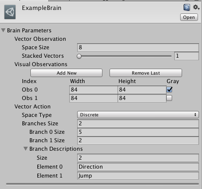
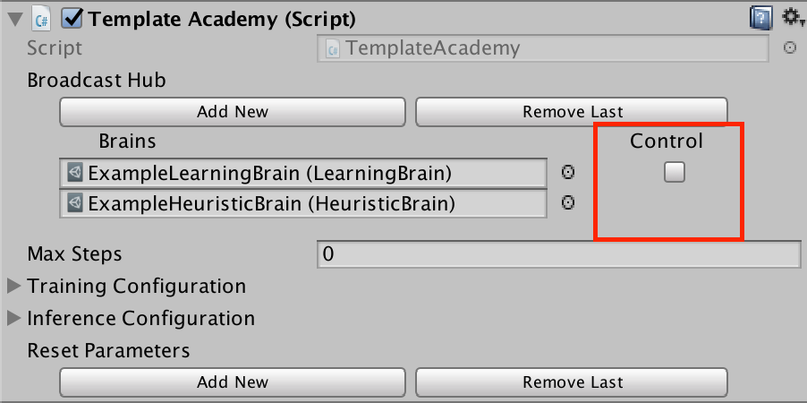

# Brains

The Brain encapsulates the decision making process. Every Agent must be
assigned a Brain, but you can use the same Brain with more than one Agent. You
can also create several Brains, attach each of the Brain to one or more than one
Agent.

There are 3 types of brains you can use:

* [Learning](Learning-Environment-Learning-Brains.md) – Set
  **Learning**  to make use of a trained model or train a new model.
* [Heuristic](Learning-Environment-Design-Heuristic-Brains.md) – Set
  **Heuristic** to hand-code the Agent's logic by extending the Decision class.
* [Player](Learning-Environment-Design-Player-Brains.md) – Set **Player** to map
  keyboard keys to Agent actions, which can be useful to test your Agent code.

During training, use an **Learning Brain** 
and drag it into the Academy's `Training Hub` with the `Train` checkbox checked.
When you want to use the trained model, import the model file into the Unity
project, add it to the **Model** property of the **Learning Brain** and uncheck
the `Train` checkbox of the `Training Hub`.

Brain assets has several important properties that you can set using the
Inspector window. These properties must be appropriate for the Agents using the
Brain. For example, the `Vector Observation Space Size` property must match the
length of the feature vector created by an Agent exactly. See
[Agents](Learning-Environment-Design-Agents.md) for information about creating
agents and setting up a Brain instance correctly.

## Brain Properties

The Brain Inspector window in the Unity Editor displays the properties assigned
to a Brain component:

* `Brain Parameters` - Define vector observations, visual observation, and
  vector actions for the Brain.
  * `Vector Observation`
    * `Space Size` - Length of vector observation for Brain.
    * `Stacked Vectors` - The number of previous vector observations that will
      be stacked and used collectively for decision making. This results in the
      effective size of the vector observation being passed to the Brain being:
      _Space Size_ x _Stacked Vectors_.
  * `Visual Observations` - Describes height, width, and whether to grayscale
    visual observations for the Brain.
  * `Vector Action`
    * `Space Type` - Corresponds to whether action vector contains a single
      integer (Discrete) or a series of real-valued floats (Continuous).
    * `Space Size` (Continuous) - Length of action vector for Brain.
    * `Branches` (Discrete) - An array of integers, defines multiple concurrent
      discrete actions. The values in the `Branches` array correspond to the
      number of possible discrete values for each action branch.
    * `Action Descriptions` - A list of strings used to name the available
      actions for the Brain.

The other properties of the brain depend on the type of Brain you are using.

## Using the Broadcast Feature

The Player, Heuristic and Learning Brains can support
broadcast to an external process. The broadcast feature allows you to collect data 
from your Agents using a Python program without controlling them.

### How to use: Unity

To turn it on in Unity, drag the Brain into the Academy's training hub but leave
the `Train` checkbox unchecked when present. This will expose the Brain's data 
without letting the external process control it.

### How to use: Python

When you launch your Unity Environment from a Python program, you can see what
the Agents connected to Brains present in the `Training Hub` are doing. 
When calling `step` or
`reset` on your environment, you retrieve a dictionary mapping Brain names to
`BrainInfo` objects. The  dictionary contains a `BrainInfo` object for each
Brain in the `Training Hub`.

Just like with an Learning Brain, the `BrainInfo` object contains the fields for
`visual_observations`, `vector_observations`,  `text_observations`,
`memories`,`rewards`, `local_done`, `max_reached`, `agents` and
`previous_actions`. Note that `previous_actions` corresponds to the actions that
were taken by the Agents at the previous step, not the current one.

Note that when you do a `step` on the environment, you can only provide actions
for the Brains in the `Training Hub` with the `Train` checkbox checked. If there
are Brains in the `Training Hub` with the 
`Train` checkbox checked, simply call `step()` with no arguments.

You can use the broadcast feature to collect data generated by Player,
Heuristics or Learning Brains game sessions. You can then use this data to train
an agent in a supervised context.
